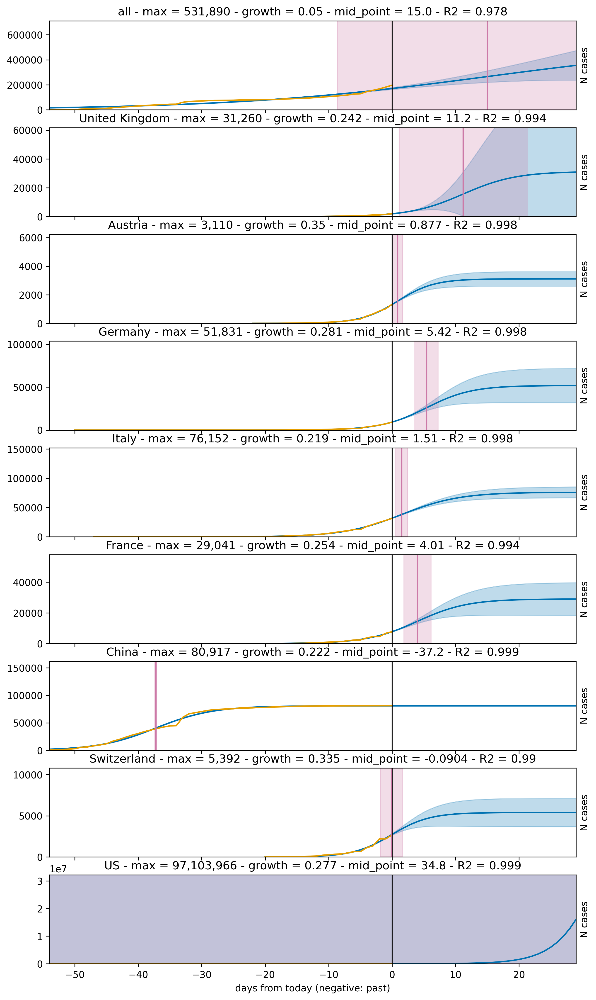
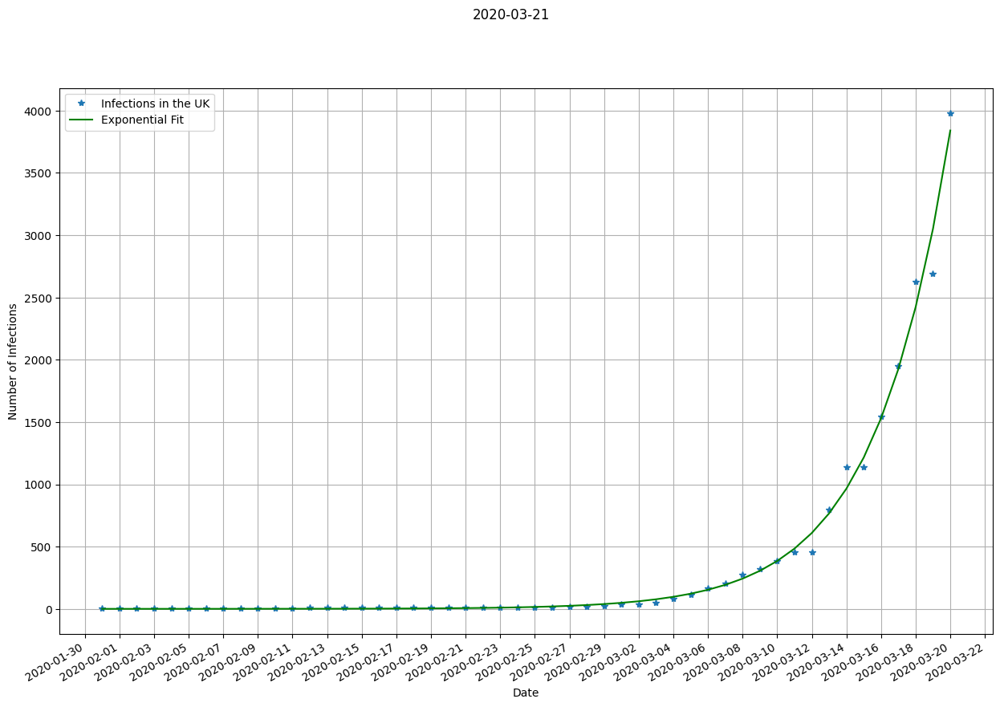
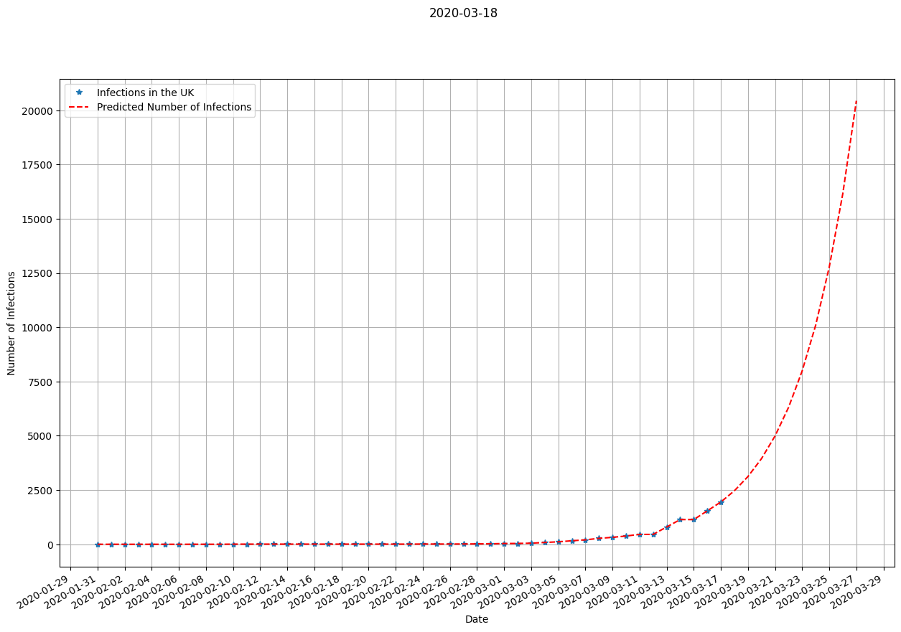

# Live Covid-19 extrapolation of infected persons in the United Kingdom and elsewhere

Updates every hour, but depends on if there is new data published.

## Detailed analysis of all countries, UK, Austria, Germany, Italy, France, China, Switzerland, US

## Current situation

## Extrapolation for 10 days (Basic exponential growth assumed)

## Data source

[Data Repository by Johns Hopkins CSSE](https://github.com/CSSEGISandData/COVID-19)
