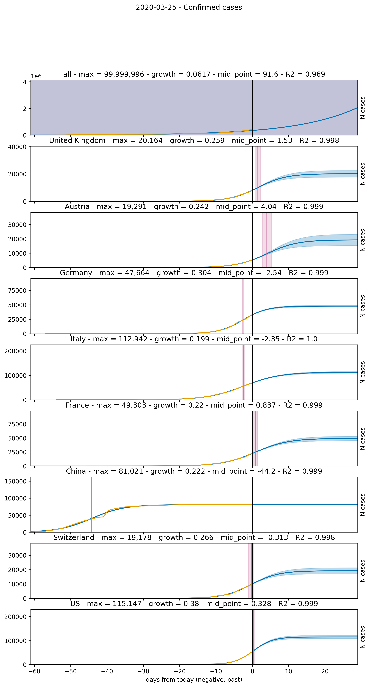
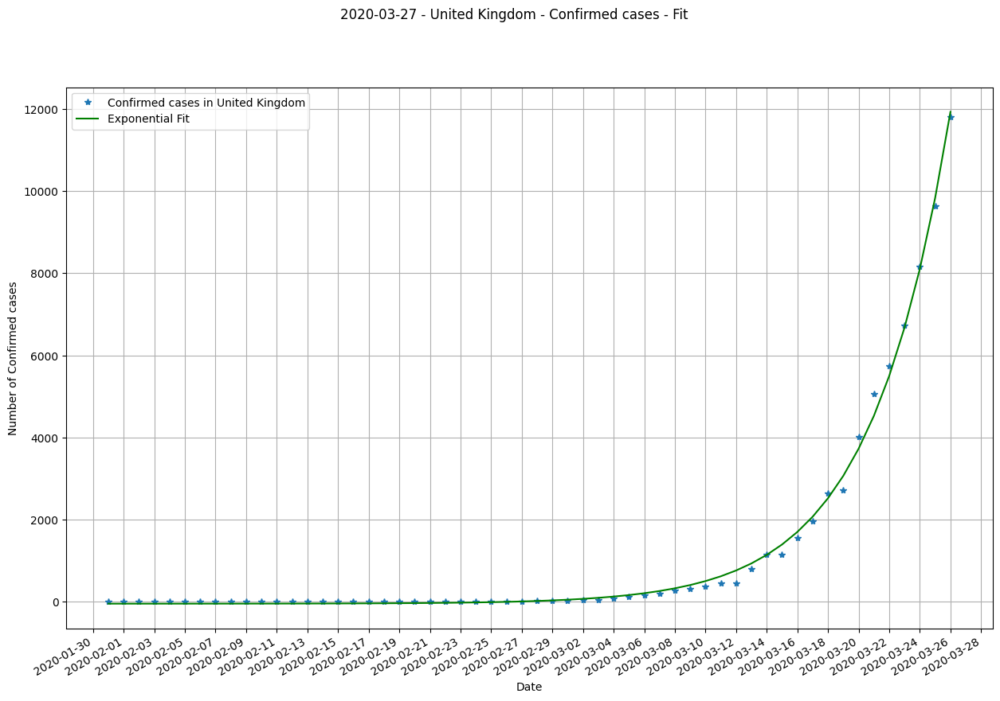
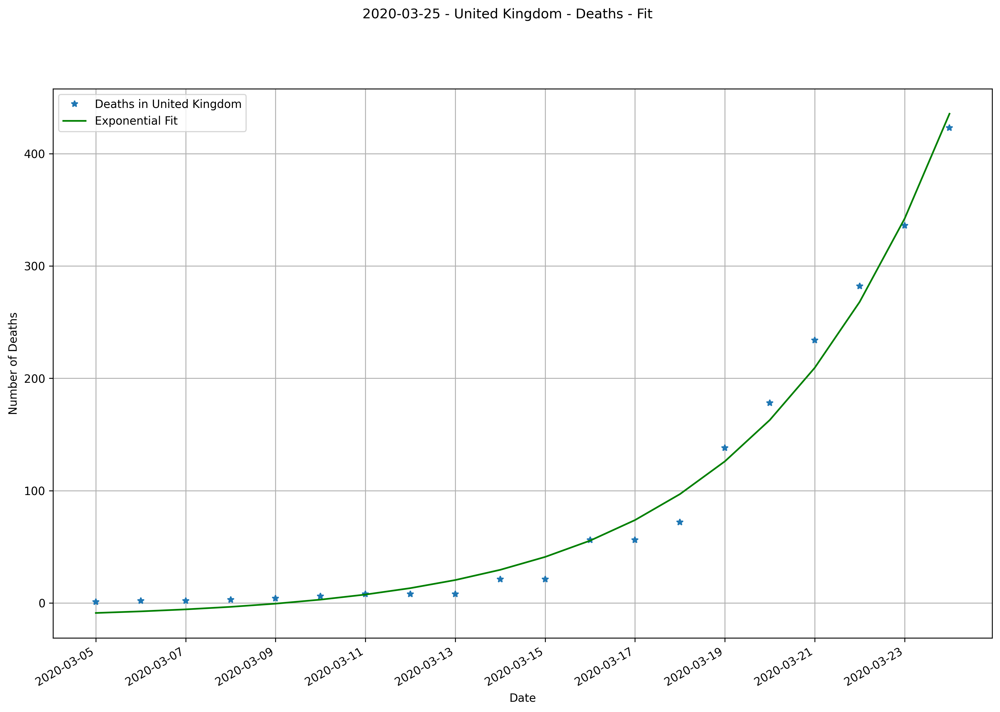
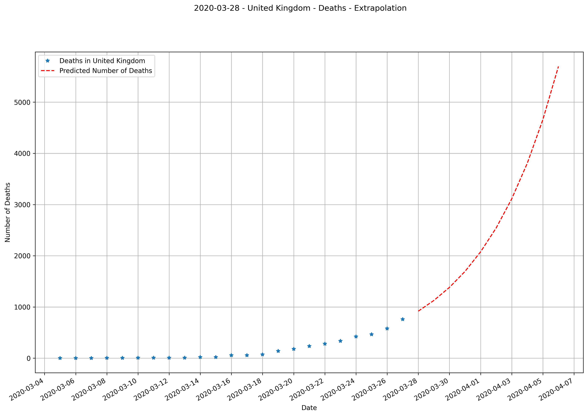

# Live Covid-19 extrapolation of infected persons in Brazil

Updates as soon as new data is published.

## Logistical extrapolation of confirmed cases for all countries, UK, Austria, Germany, Italy, France, China, Switzerland, US

## Logistical extrapolation of deaths for all countries, UK, Austria, Germany, Italy, France, China, Switzerland, US

## Current confirmed cases for UK

## Basic 10 day exponential extrapolation of confirmed cases for UK

## Current deaths for UK

## Basic 10 day exponential extrapolation of deaths for UK

## Data source

[Data Repository by Johns Hopkins CSSE](https://github.com/CSSEGISandData/COVID-19)
